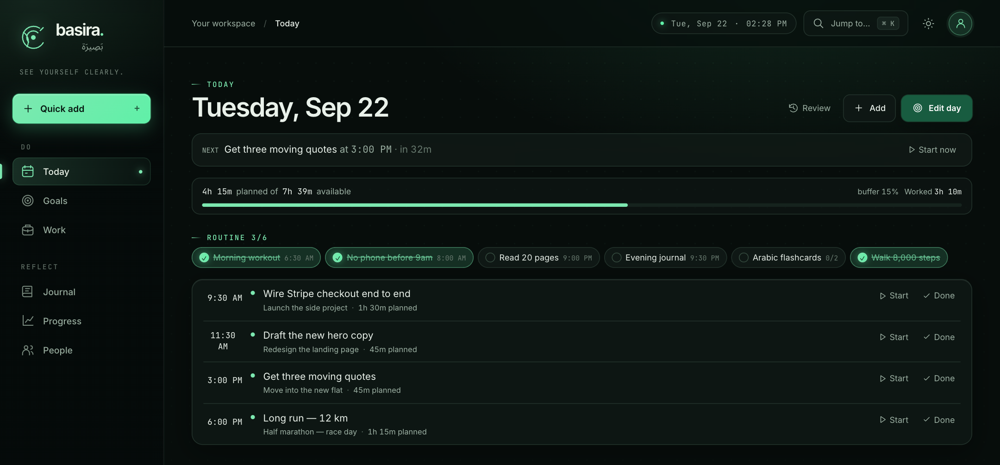
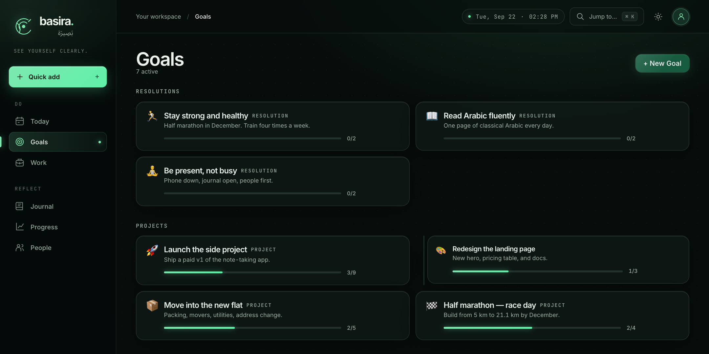
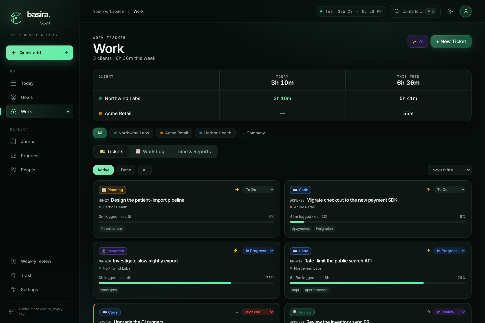
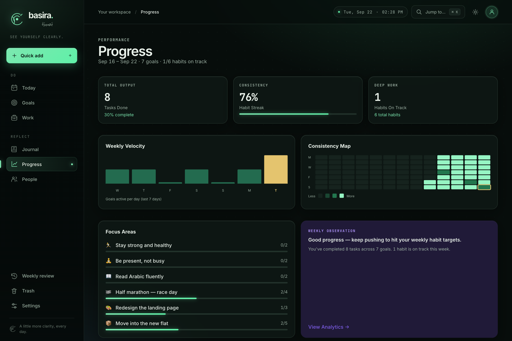
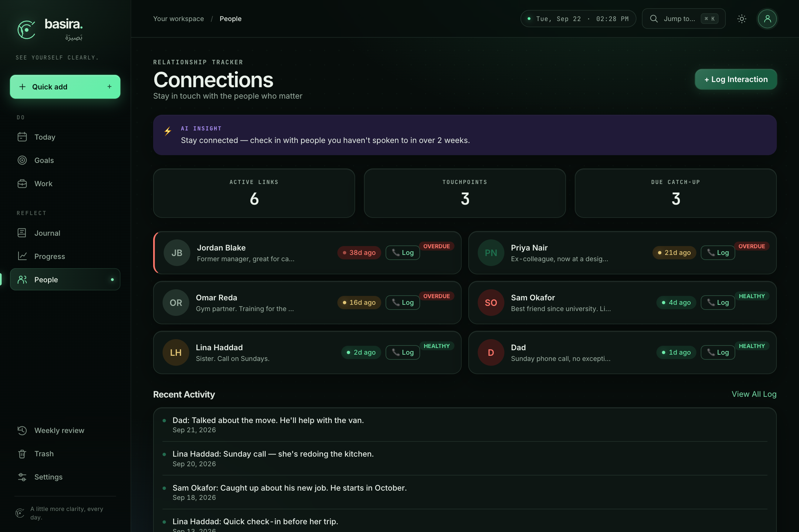
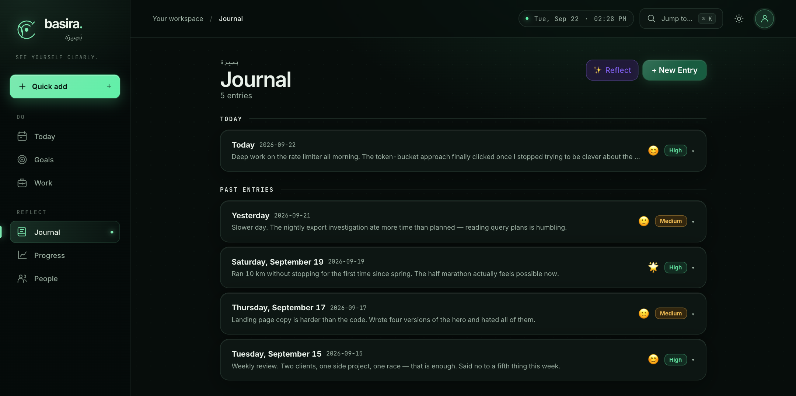
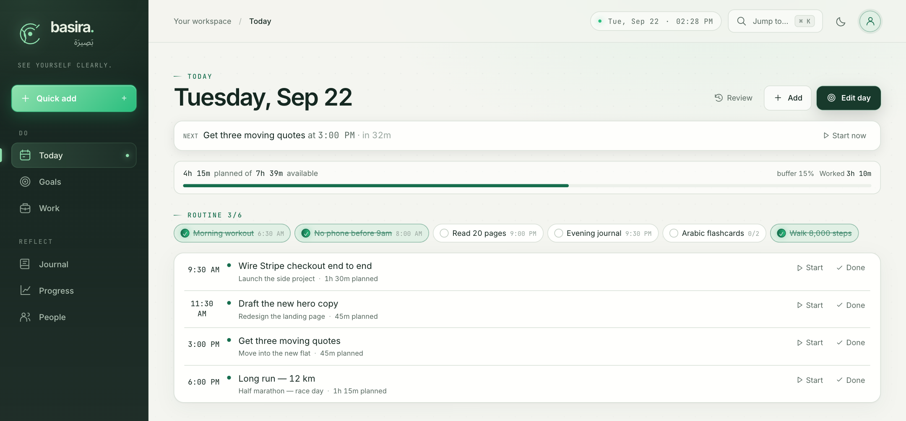

# بَصِيرَة — Basira

> *"Rather, man will be a witness against himself, even though he may offer his excuses."*
> — Al-Qiyamah 75:14–15

> *"And within yourselves — do you not see?"*
> — Adh-Dhariyat 51:21

**Basira** (بَصِيرَة) means inner sight, clarity, and evidence. The root *b-s-r* (ب-ص-ر) means to see — not just outward, but inward. In the Quran it carries the meaning of evidence, witness, and deep self-knowledge.

This app is your *basira* — a mirror of your own life in data. The time you logged, the habits you kept or skipped, the goals you moved toward or avoided. You cannot hide from your own numbers. The data sees you even when you look away.

---


---

## What is Basira?

Basira is a **self-hosted personal OS** — a single app that tracks every dimension of your life so you can see yourself clearly and act accordingly. No cloud, no subscriptions, no data shared with anyone. You own everything.

It is built on a simple idea: **the person who knows themselves best wins**. Most people drift. Basira gives you evidence — about your time, your energy, your relationships, and your progress — so you can stop guessing and start improving.

| Module | What it tracks |
|--------|---------------|
| **Today** | The day itself — routine check marks, one agenda, live timer, capacity line |
| **Goals** | Resolutions, projects, and daily goals with progress tracking |
| **Work** | Client work — tickets, time per company, proof of work |
| **People** | Relationships — contacts, interaction logs, overdue-check alerts |
| **Journal** | Daily entries — mood, energy, wins, and what to do differently |
| **Progress** | Analytics — weekly velocity, consistency heatmap, AI insights |

---

## How it looks

> Every screenshot below is a throwaway demo database — fictional goals, clients,
> tickets and contacts. None of it is real personal data.

### Today — one day, one screen

Your routine as check marks, an agenda built from tasks and client tickets, and a
capacity line that tells you how much of the day you have actually planned.



### Goals — resolutions, projects, and the work under them

Resolutions carry the habits that feed them. Projects carry the tasks (and
sub-projects) that finish them. Progress is counted, not claimed.



### Work — clients, tickets, and where the hours went

Time per client for today and this week, Jira-style tickets with estimate-vs-actual
bars, a built-in timer, and a report generator for the end of the month.



### Progress — the mirror

Output, consistency, and habit streaks over time — plus a 13-week consistency map
that makes a skipped week impossible to argue with.



### People — the relationships you say matter

Each contact ages until you log an interaction. Overdue is overdue, no matter how
busy the week was.



### Journal — a sentence a day

Mood, energy, wins, and what to do differently, kept next to the data that explains it.



### Light and dark

The whole UI is token-themed and follows your system preference by default.



---

## Features

- **Task management** with subtasks, urgency/importance flags, due dates, and habit tracking
- **Work tickets** (Jira-style) with a built-in timer, time logging, and status workflow
- **Time breakdown** per client — today vs. this week, including ticket time
- **Screenshot paste** — paste any image directly into a ticket as proof
- **People CRM** with interaction logs and overdue-contact alerts
- **AI assistant** powered by Groq (free tier) — standups, weekly summaries, task coaching
- **Weekly review** mode with structured self-reflection
- **Habit reminders** via macOS notifications from a background scheduler
- **Fully local** — SQLite database, files on disk, no external services required

---

## The Philosophy

The Quran asks: *"Do you not see within yourselves?"* — وَفِي أَنْفُسِكُمْ أَفَلَا تُبْصِرُونَ

Most productivity tools help you do more. Basira helps you **see more** — about who you are, how you spend your time, what you actually finish, and who you keep in touch with. The goal is not busyness. It is *basira*: the clarity that comes from honest self-knowledge.

---

## Tech Stack

| Layer | Technology |
|-------|-----------|
| Backend | Python 3.12 · FastAPI · SQLAlchemy · SQLite |
| Frontend | React 18 · Vite · Tailwind CSS v3 · @dnd-kit |
| AI | [Groq API](https://console.groq.com) (free) via OpenAI-compatible client |
| Scheduler | Python threading — macOS notifications via `osascript` |

---

## Install on macOS

### Prerequisites

- macOS 14+ (notifications use `osascript`; the rest works cross-platform)
- Python 3.11+ — `brew install python@3.12`
- Node.js 18+ — `brew install node`

### One command

```bash
git clone https://github.com/mostafaelkabir/basira.git
cd basira
./install.sh
```

That creates the virtualenv, installs the Python dependencies, builds the React
frontend, writes a `.env` for you, and registers a **launchd** service so the
backend starts at login and restarts if it ever crashes. When it finishes, open
**http://localhost:8001**. The database is created on first run.

Useful flags:

```bash
./install.sh --app          # also build and install the native Basira.app
./install.sh --no-service   # set everything up, but start the backend yourself
./install.sh --port 8002    # run on a different port
```

Re-running `./install.sh` is safe — every step is idempotent, and it is also how
you update after a `git pull`.

### Native macOS app (optional)

```bash
./install.sh --app     # or: macos/build.sh
open -a Basira
```

A SwiftUI window around the same UI, with its own Dock icon, plus a **Today**
desktop widget (right-click the desktop → *Edit Widgets* → search "Basira").
Building it needs Xcode and `xcodegen` (`brew install xcodegen`); it signs
locally, so no Apple developer account is required. See
[macos/README.md](macos/README.md).

### AI features (optional)

Open `.env` and add a Groq key — free at [console.groq.com](https://console.groq.com):

```
GROQ_API_KEY=gsk_...
```

Then restart the service: `launchctl kickstart -k gui/$UID/com.basira.backend`.
Everything except the AI panels works without a key.

### Managing the service

```bash
tail -f /tmp/basira-backend.log                       # logs
launchctl kickstart -k gui/$UID/com.basira.backend    # restart
launchctl bootout gui/$UID/com.basira.backend         # stop until next login
./uninstall.sh                                        # remove service + app
```

`./uninstall.sh` leaves `sysgo.db`, `uploads/` and `.env` alone — your data is
only ever in this folder.

### Manual setup

If you would rather not run the installer:

```bash
python3 -m venv venv
venv/bin/pip install -r requirements.txt
cd frontend && npm install && npm run build && cd ..
cp .env.example .env
venv/bin/uvicorn app.main:app --port 8001
```

---

## Project Structure

```
basira/
├── app/
│   ├── main.py          # FastAPI app, auto-migrations, static serving
│   ├── database.py      # SQLAlchemy engine (SQLite)
│   ├── scheduler.py     # Background habit reminder thread
│   ├── models/          # SQLAlchemy ORM models
│   └── routes/          # FastAPI route handlers
├── frontend/
│   ├── src/
│   │   ├── App.jsx      # Root: sidebar nav + page routing
│   │   ├── api.js       # All API calls (single source of truth)
│   │   ├── TodayPage.jsx
│   │   ├── GoalsPage.jsx
│   │   ├── WorkPage.jsx
│   │   ├── ContactsPage.jsx
│   │   ├── ProgressPage.jsx
│   │   └── components/
│   └── vite.config.js
├── macos/               # SwiftUI app + Today widget (build.sh)
├── docs/                # product notes and screenshots
├── install.sh           # one-command macOS install
├── uninstall.sh         # remove the service and the app
├── requirements.txt
├── .env.example
└── README.md
```

---

## Environment Variables

| Variable | Required | Description |
|----------|----------|-------------|
| `GROQ_API_KEY` | Optional | Enables AI features. Free key at [console.groq.com](https://console.groq.com) |

---

## Development

### Work time and manager reports

Open **Work → Time & Reports**. Select a company (or All), then a month,
Monday–Sunday week, or custom range of up to 366 days. Current weeks/months
show time to date. Expand a week and a day to inspect the underlying entries.
The editable manager report supports a concise update or detailed timesheet,
with plain-text and Markdown copy options. Draft edits affect only the report;
changing the period or refreshing totals starts a fresh draft.

Reporting reads saved ticket time entries and standalone work-log totals once,
using their saved dates. It does not add timer sessions again or include running
timers before they are stopped. Standalone logs retain their original recorded
date; historical hours are not redistributed. Legacy entries with only minutes
are interpreted on read. No reporting migrations or updates to logged data are
required. Ticket statuses are not used to infer historical accomplishments.

Run the isolated reporting checks (no production database access):

```bash
venv/bin/python -m unittest discover -s tests -v
node --test frontend/src/workReportUtils.test.js
```

```bash
# Backend with hot-reload
venv/bin/uvicorn app.main:app --port 8001 --reload

# Frontend dev server (separate terminal)
cd frontend && npm run dev
```

After editing frontend files for production, rebuild:

```bash
cd frontend && npm run build
```

---

## Contributing

Contributions are welcome. Some open directions:

- [ ] Cross-platform notifications (Linux / Windows)
- [ ] Mobile-friendly responsive layout
- [ ] Export to PDF (weekly report, payment summary)
- [ ] Multi-user / family support

Please open an issue first to discuss larger changes.

---

## License

MIT — free to use, modify, and share. Attribution appreciated.

---

*Built by [Mostafa El-Kabir](https://github.com/mostafaelkabir)*

*"See yourself clearly."*
